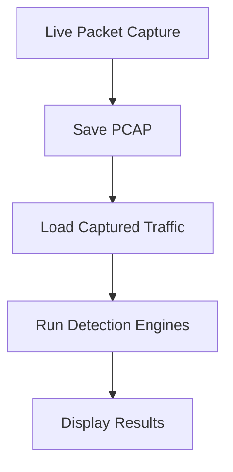
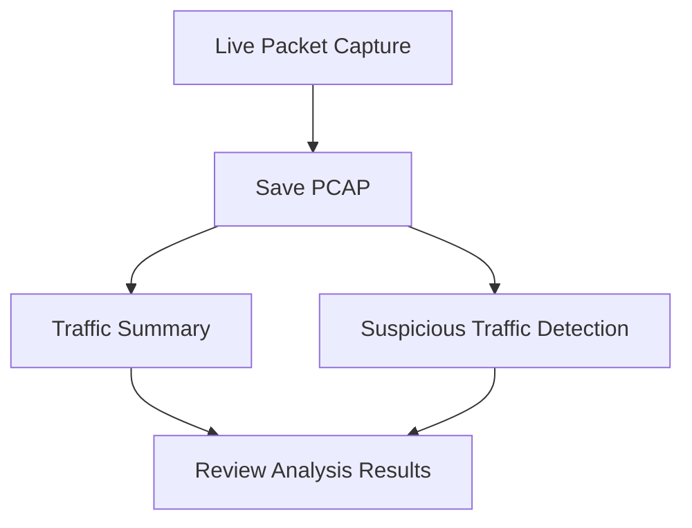

# Network Traffic Analyzer

A Python-based command-line network security tool for **live packet capture, traffic analysis, and suspicious network activity detection**. Built with **Python and Scapy**, the tool provides a modular workflow for capturing network traffic, generating traffic statistics, and identifying potentially suspicious behavior using configurable detection rules and thresholds.

## Table of Contents

| No. | Contents |
| --- | --- |
| 1 | [Installation](#installation) |
| 2 | [Usage](#usage) |
| 3 | [Technologies](#technologies) |
| 4 | [Key Features](#key-features) |
| 5 | [Feature Details](#feature-details) |
| 6 | [Configuration](#configuration) |
| 7 | [Detection Capabilities](#detection-capabilities) |
| 8 | [Detection Scoring](#detection-scoring) |
| 9 | [Traffic Analysis Workflow](#traffic-analysis-workflow) |
| 10 | [Project Structure](#project-structure) |
| 11 | [Testing](#testing) |
| 12 | [Data Sources & Citation](#data-sources--citation) |
| 13 | [Limitations](#limitations) |
| 14 | [Future Improvements](#future-improvements) |
| 15 | [Disclaimer](#disclaimer) |

## Installation

### Requirements

- Python 3.10.12
- Scapy
- PyYAML

### 1. Clone the Repository

```bash
git clone https://github.com/rhaelfixer/Network-Traffic-Analyzer.git
```

### 2. Create a Virtual Environment

```bash
python3 -m venv .venv
```

### 3. Activate the Virtual Environment

```bash
source .venv/bin/activate
```

### 4. Install Dependencies

```bash
pip install -r requirements.txt
```

## Usage

Run the application with:

```bash
python main.py
```

For live packet capture on Linux, elevated privileges may be required:

```bash
sudo .venv/bin/python main.py
```

### Main Menu

1. Packet Capture
2. Traffic Summary
3. Detect Suspicious Traffic
4. Capture + Detection
5. Exit

## Technologies

| Category | Technologies |
| --- | --- |
| **Language** | Python 3.10.12 |
| **Packet Capture & Analysis** | Scapy |
| **Configuration** | PyYAML |
| **Data Format** | PCAP |

## Key Features

- **Live Packet Capture:** Capture live network traffic using protocol, service, and custom BPF filters.
- **PCAP Analysis:** Analyze existing PCAP files without requiring live capture.
- **Traffic Statistics:** Generate traffic, protocol, IP, TCP, and conversation statistics.
- **Suspicious Traffic Detection:** Identify potentially suspicious network behavior using multiple detection engines.
- **Configurable Detection Rules:** Modify detection thresholds through YAML without changing detection source code.
- **Modular Architecture:** Separate packet capture, traffic analysis, detection engines, configuration, and CLI components.
- **Capture + Detection Workflow:** Combine live packet capture and automated suspicious traffic detection in a single workflow.

## Feature Details

### Packet Capture

Capture live network traffic using Scapy with support for protocol, service, and custom BPF filters.

Supported capture options include:

- All Traffic
- IPv4
- IPv6
- ICMP
- ICMPv6
- ARP
- TCP
- UDP
- SCTP
- DNS
- HTTP
- HTTPS
- DHCP
- SSH
- Custom BPF Filter

Captured traffic can be saved as PCAP files for later analysis.

### Traffic Summary

Analyze captured PCAP files using multiple traffic analysis options.

Supported summary options include:

- Traffic Summary
- Protocol Statistics
- IP Statistics
- TCP Statistics
- Conversation Statistics

### Suspicious Traffic Detection

Analyze captured network traffic using multiple detection engines with configurable rules and thresholds.

Supported detection engines include:

- Port Scan Detection
- Unusual Port Detection
- SYN Flood Detection
- ICMP Flood Detection
- ARP Anomaly Detection
- DNS Anomaly Detection
- Traffic Rate Anomalies

Each detection engine evaluates different traffic characteristics relevant to the behavior it is designed to identify.

### Capture + Detection

Capture live network traffic, save the resulting PCAP file, and automatically run the suspicious traffic detection engines against the captured traffic.



This provides an end-to-end workflow from live traffic collection to automated suspicious activity analysis.

## Configuration

Detection settings are stored in:

- `config/config.py` - Defines configuration models using Python dataclasses and loads the YAML configuration.
- `config/config.yaml` - Stores detection thresholds and configurable settings.

The configuration file allows detection thresholds to be modified without changing the detection source code. This makes it possible to adjust detection sensitivity for different traffic environments and testing scenarios.

Example configuration categories include:

- Port Scan
- Unusual Port
- SYN Flood
- ICMP Flood
- DNS Anomaly
- Traffic Rate

## Detection Capabilities

### Port Scan Detection

Evaluates network traffic for scanning behavior using indicators such as:

- Unique destination ports
- Port scan rate
- SYN/ACK response ratio
- Failure ratio
- Sequential behavior
- Target concentration
- Confidence score

### Unusual Port Detection

Identifies potentially unusual port activity using:

- Known services
- Rare ports
- Privileged ports
- Dynamic ports
- Protocol/port context
- Connection frequency

The detector considers the context of the observed protocol and port rather than treating every non-standard port as malicious.

### SYN Flood Detection

Analyzes TCP SYN traffic using indicators such as:

- SYN rate
- SYN → SYN-ACK ratio
- SYN → ACK ratio
- Half-open ratio
- Source diversity
- Target concentration
- Confidence score

These indicators help identify traffic patterns associated with TCP SYN flooding.

### ICMP Flood Detection

Analyzes ICMP traffic using:

- Packets per second
- Request/reply ratio
- Source diversity
- Target concentration
- Burst score

### ARP Anomaly Detection

Analyzes ARP traffic for potentially suspicious behavior including:

- IP → MAC conflicts
- MAC → multiple IP mappings
- Gratuitous ARP activity
- Request/reply imbalance
- Broadcast rate

### DNS Anomaly Detection

Analyzes DNS traffic using indicators such as:

- Query rate
- Unique domains
- NXDOMAIN ratio
- Query types
- Domain entropy
- Source concentration

These indicators can help identify unusual DNS behavior and potential DNS-based anomalies.

### Traffic Rate Anomalies

Identifies unusually high or bursty traffic using:

- Packets per second
- Bytes per second
- Burst detection
- Baseline deviation
- Source concentration
- Destination concentration

## Detection Scoring

The detection engines evaluate multiple indicators using configurable rules and thresholds. Each detection engine calculates a confidence score based on the characteristics observed in the analyzed traffic. The resulting score is compared against the detection engine's configured minimum confidence threshold.

For display purposes, confidence scores are classified as:

| Severity | Confidence |
| --- | --- |
| HIGH | 80 - 100 |
| MEDIUM | 60 - 79 |
| LOW | 0 - 59 |

Detection results should be interpreted in the context of the surrounding network traffic rather than treated as definitive proof of malicious activity.

## Traffic Analysis Workflow

A typical analysis workflow is:



Existing PCAP files can also be analyzed directly without performing a live capture.

This allows the tool to be used for both:

- Live traffic analysis
- Offline PCAP analysis

## Project Structure

<table align="center">
    <tr>
        <td>
<pre style="text-align: left;">
network-traffic-analyzer/
│
├── capture_detection/
│   └── capture_detection.py
│
├── captures/
│   └── *.pcap
│
├── config/
│   ├── config.py
│   └── config.yaml
│
├── detection/
│   ├── arp_anomaly.py
│   ├── detection.py
│   ├── dns_anomaly.py
│   ├── icmp_flood.py
│   ├── port_scan.py
│   ├── syn_flood.py
│   ├── traffic_rate.py
│   └── unusual_port.py
│
├── packet_capture/
│   ├── bpf_filter.py
│   ├── capture_menu.py
│   ├── capture.py
│   ├── packet_display.py
│   └── parser.py
│
├── suspicious_traffic/
│   └── suspicious_traffic.py
│
├── traffic_summary/
│   ├── statistics.py
│   ├── summary_menu.py
│   └── summary.py
│
├── utils/
│   ├── menu_display.py
│   └── pcap_loader.py
│
├── .gitignore
├── main.py
├── README.md
└── requirements.txt
</pre>
        </td>
    </tr>
</table>

## Testing

The detection engines were tested using PCAP captures containing malicious, anomalous, and normal/background network traffic.

Testing covers:

| Detection Engine | Test Traffic |
|---|---|
| Normal Traffic | Background and legitimate network traffic |
| Port Scan | TCP port scanning |
| Unusual Port | Rare or unexpected service ports |
| SYN Flood | TCP SYN flood traffic |
| ICMP Flood | High-volume ICMP traffic |
| ARP Anomaly | ARP poisoning and anomalous ARP traffic |
| DNS Anomaly | Unusual DNS queries and domain behavior |
| Traffic Rate | Unusually high network traffic |

Normal traffic captures are also used to evaluate detection behavior and identify potential false positives.

## Data Sources & Citation

### ARP Poisoning

The following PCAP file was sourced from the Packet Captures collection by Chris Sanders:

- `arppoison.pcap`

Source: Chris Sanders, [Packet Captures](https://chrissanders.org/packet-captures/).

### CIC-DDoS2019

The following PCAP files were obtained from a 2025 Zenodo dataset containing sample data from the public CIC-DDoS2019 dataset:

- `CIC-DDoS-2019-DNS.pcap`
- `CIC-DDoS-2019-SynFlood.pcap`

Original dataset: [CIC-DDoS2019](https://www.unb.ca/cic/datasets/ddos-2019.html)

Source: Antonio, Alfred, Jonathan, Djoko, Leon Saputra, and Rexi, *SDN traffic data collected from self-generated TCP SYN Flood DDoS attack within 2 hosts, 1 switch network and from public dataset CIC-DDoS2019 in 2025*, 2025, Version v2.

Available from [Zenodo](https://zenodo.org/records/17121740).

### DDoS Packet Capture Collection

The following PCAP files were sourced from the DDoS Packet Capture Collection:

- `pkt.ICMP.largeempty.pcap`
- `pkt.TCP.synflood.spoofed.pcap`

Source: L.F. Haaijer, *DDoS Packet Capture Collection*, 2022.

Available from [GitHub](https://github.com/StopDDoS/packet-captures).

## Limitations

This project is intended for **learning, testing, and network traffic analysis** rather than production network security deployment.

Current limitations include:

- Detection thresholds may require tuning for different network environments.
- Legitimate network services may sometimes produce traffic patterns that resemble suspicious activity.
- Detection results should be treated as indicators for further investigation rather than definitive proof of malicious activity.
- Detection is based on traffic available in the analyzed capture.
- Traffic baselines are not learned from long-term historical data.
- Protocol and attack detection coverage is limited compared with established production IDS platforms.

## Future Improvements

- False-positive reduction
- Improved alert aggregation
- Historical traffic baselines
- Additional protocol and attack detection
- Traffic visualization

## Disclaimer

This project is intended for **educational, research, and authorized network analysis purposes only**.

Only capture or analyze network traffic that you are authorized to inspect.